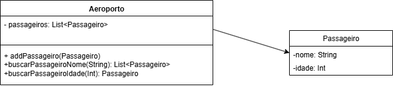

# 📖 Livro *Software Engineering at Google* (O’Reilly)
**`Engenharia de software`**

<h2>🖥Comentário - Primeiro trecho do livro </h2>

 O primeiro trecho inicia diferenciando a programação, ciência da computação e engenharia de software. Enquanto universitários geralmente estudam ciência da computação e depois atuam como programadores, o termo “engenharia de software†sugere algo mais sério, remetendo à aplicação de conhecimento teórico para construir algo real e preciso, assim como em outras engenharias (civil, mecânica, aeronáutica). Porém, diferentemente dessas áreas, a engenharia de software ainda não possui práticas e teorias tão rigorosas. Tradicionalmente, a programação não exigia padrões tão estritos, mas, à medida que o software se torna cada vez mais central na vida cotidiana, cresce a necessidade de métodos mais confiáveis e sistemáticos.<strong> O objetivo do livro é justamente indicar caminhos para práticas de software mais robustas.</strong> 

<h2>🖥Comentário - Segundo trecho do livro </h2>

 O trecho dois apresenta algumas perguntas comuns na área de engenharia de software, as quais não possuem respostas fundamentais.
Mas que podem ser estipulados possíveis caminhos para encontrar essas respostas. Além disso, o livro considera a engenharia de software uma 
programação integrada ao longo do tempo e questiona como um código pode se tornar sustentável ao longo do tempo.Ele conclui apresentando três principais fundamentos para projetar, arquitetar e escrever o seu código, os quais são: 
  <ul>
  <li>Tempo e mudança
     
Esse princípio reconhece que todo software está sujeito a mudanças com o passar do tempo. Isso pode acontecer por diversos motivos: mudanças nos requisitos do cliente, novas tecnologias, correções de erros, ou 
  evolução do mercado. Por isso, o código precisa ser projetado com flexibilidade e manutenibilidade em mente.

    
  <li>Escala e crescimento 
      
Este fundamento trata da capacidade do software de crescer, tanto em termos de quantidade de usuários, quanto em funcionalidades e complexidade técnica.

  <li>Compensações e custos  
      
Na engenharia de software, não existem soluções perfeitas — tudo envolve compromissos (trade-offs).Ou seja, o engenheiro de software precisa avaliar custos de curto e longo prazo ao tomar decisões técnicas.

  </ul>
  

 
<h2>📌Trade offs </h2>

 Trade-off é termo muito utilizado na economia e que exige a escolha entre duas ou mais opções, sabendo que
ao escolher uma, abrimos mão das outras.

<b>3 exemplos</b> de Trade offs:
  <ul>
  <li>Tempo vs dinheiro
    
Escolher entre tempo e dinheiro depende das prioridades — se o prazo é apertado, o dinheiro pode ser o recurso a ser sacrificado; se há mais tempo disponível, pode-se reduzir os custos.

    
  <li>Qualidade vs preço
    
Nem sempre o mais caro é o melhor, mas buscar sempre o "mais barato" pode sair caro no longo prazo. O ideal é encontrar o equilíbrio entre o custo e o valor entregue.

  <li>Consumo Presente vs poupança futura
    
Viver o presente é importante, mas um planejamento financeiro saudável envolve equilíbrio — poupar hoje pode garantir tranquilidade amanhã, enquanto o consumo excessivo pode levar a problemas futuros.

  </ul>
  

 
<h2>📝Diagrama de Classes UML</h2>
<h3>📌Primeiro</h3>

<h3>📌Segundo</h3>

<h2>Código em Java</h2>
<h3>Classe Aeroporto</h3>
<pre><code> 
import java.util.List;
import java.util.ArrayList;

class Aeroporto {

    private List<Passageiro> passageiros;

    public Aeroporto() {
        passageiros = new ArrayList<>();
    }

   
    public void addPassageiro(Passageiro passageiro) {
        passageiros.add(passageiro);
    }

    
    public List<Passageiro> buscarPassageiroNome(String nome) {
        List<Passageiro> resultado = new ArrayList<>();
        for (Passageiro p : passageiros) {
            if (p.getNome().equals(nome)) {
                resultado.add(p);
            }
        }
        return resultado;
    }

   
    public List<Passageiro> buscarPassageiroIdade(int idade) {
        List<Passageiro> resultado = new ArrayList<>();
        for (Passageiro p : passageiros) {
            if (p.getIdade() == idade) {
                resultado.add(p);
            }
        }
        return resultado;
    }
}
</code></pre>

<h3>Classe Passageiro</h3>
<pre><code> 
class Passageiro {

    private String nome;
    private int idade;

    
    public Passageiro(String nome, int idade) {
        this.nome = nome;
        this.idade = idade;
    }

   
    public String getNome() {
        return nome;
    }

  

    public int getIdade() {
        return idade;
    }
}
</code></pre>
